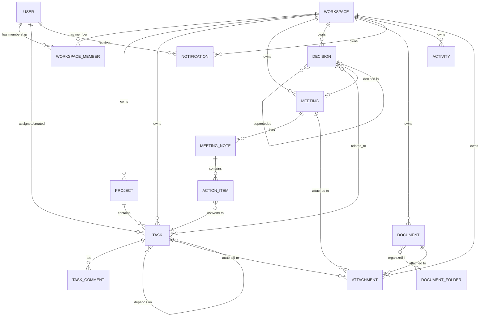

# FlowDesk Backend - Database Reference

Database: **MongoDB** (via Mongoose ODM). Connection string: `MONGODB_URI` (see docs/SETUP.md).

## Data isolation strategy

Every workspace-owned collection carries a `workspaceId: ObjectId` field. No query in the codebase reads or writes a workspace-owned document without first resolving a **DB-verified** `workspaceId`:

- Routes nested under `/workspaces/:workspaceId/...` verify membership via `requireWorkspaceMember` (reads `:workspaceId` from the URL, checks `WorkspaceMember` in MongoDB).
- Flat routes (`/tasks/:id`, `/decisions/:id`, ...) verify membership via `resolveWorkspaceFromParam`, which loads the entity first and reads `workspaceId` **off the stored document**, never off client input.
- Every repository list/find method that returns workspace data takes `workspaceId` as a mandatory filter (e.g. `findByIdInWorkspace(id, workspaceId)` returns `null` - and the service throws 404 - if the document exists but belongs to a different workspace).

This means a user who is a member of Workspace A can never read, modify, or discover the existence of a resource in Workspace B, even by guessing a valid MongoDB ObjectId.

## Entity-relationship diagram

## Collections

### User
| Field | Type | Required | Notes |
|---|---|---|---|
| name | String | yes | max 120 |
| email | String | yes | unique, lowercased, indexed |
| passwordHash | String | yes | bcrypt hash, `select: false` |
| avatarUrl | String | no | |
| tokenVersion | Number | yes | default 0; incremented on logout/password change to revoke refresh tokens |
| passwordResetTokenHash | String | no | SHA-256 hash of the reset token, `select: false` |
| passwordResetExpiresAt | Date | no | `select: false` |
| lastLoginAt | Date | no | |

Indexes: `email` (unique).

### Workspace
| Field | Type | Required | Notes |
|---|---|---|---|
| name | String | yes | max 120 |
| slug | String | yes | unique, URL-safe |
| description | String | no | max 500 |
| ownerId | ObjectId → User | yes | |

Indexes: `slug` (unique), `ownerId`.

### WorkspaceMember
| Field | Type | Required | Notes |
|---|---|---|---|
| workspaceId | ObjectId → Workspace | yes | |
| userId | ObjectId → User | yes | |
| role | String enum | yes | ADMIN / MANAGER / MEMBER |
| invitedBy | ObjectId → User | no | |
| joinedAt | Date | yes | |

Indexes: `{workspaceId, userId}` unique compound (one membership per user per workspace).

### Project
| Field | Type | Required | Notes |
|---|---|---|---|
| workspaceId | ObjectId → Workspace | yes | |
| name | String | yes | max 160 |
| key | String | yes | uppercase, unique per workspace |
| description | String | no | max 2000 |
| status | String enum | yes | PLANNING / ACTIVE / ON_HOLD / COMPLETED / ARCHIVED |
| priority | String enum | yes | LOW / MEDIUM / HIGH / URGENT |
| ownerId | ObjectId → User | yes | |
| startDate | Date | no | |
| dueDate | Date | no | |
| members | ObjectId[] → User | no | |

Indexes: `{workspaceId, key}` unique, `{workspaceId, status}`, text index on `name, description`.

### Task
| Field | Type | Required | Notes |
|---|---|---|---|
| workspaceId | ObjectId → Workspace | yes | |
| projectId | ObjectId → Project | yes | |
| title | String | yes | max 200 |
| description | String | no | max 5000 |
| status | String enum | yes | TODO / IN_PROGRESS / IN_REVIEW / BLOCKED / DONE |
| priority | String enum | yes | LOW / MEDIUM / HIGH / URGENT |
| assigneeId | ObjectId → User | no | |
| createdBy | ObjectId → User | yes | |
| labels | String[] | no | max 20 |
| dueDate | Date | no | |
| dependsOn | ObjectId[] → Task | no | validated: no self, same workspace+project, acyclic |
| attachments | ObjectId[] → Attachment | no | |
| completedAt | Date | no | set/cleared automatically on status transitions to/from DONE |

Indexes: `{workspaceId, projectId, status}`, `{workspaceId, assigneeId, status}`, `dueDate`, text index on `title, description`.

### TaskComment
| Field | Type | Required | Notes |
|---|---|---|---|
| workspaceId | ObjectId → Workspace | yes | |
| taskId | ObjectId → Task | yes | |
| authorId | ObjectId → User | yes | |
| content | String | yes | max 5000 |
| mentions | ObjectId[] → User | no | auto-extracted `@email` mentions resolved to workspace members |
| editedAt | Date | no | |

Indexes: `{taskId, createdAt}`.

### Meeting
| Field | Type | Required | Notes |
|---|---|---|---|
| workspaceId | ObjectId → Workspace | yes | |
| projectId | ObjectId → Project | no | |
| title | String | yes | max 200 |
| description | String | no | max 3000 |
| status | String enum | yes | SCHEDULED / COMPLETED / CANCELLED |
| scheduledAt | Date | yes | |
| durationMinutes | Number | no | |
| organizerId | ObjectId → User | yes | |
| participants | ObjectId[] → User | no | |
| attachments | ObjectId[] → Attachment | no | |

Indexes: `scheduledAt`, `status`, text index on `title, description`.

### MeetingNote (embeds ActionItem[])
| Field | Type | Required | Notes |
|---|---|---|---|
| workspaceId | ObjectId → Workspace | yes | |
| meetingId | ObjectId → Meeting | yes | |
| authorId | ObjectId → User | yes | |
| content | String | no | max 20000 |
| actionItems | ActionItem[] | no | embedded subdocuments |

**ActionItem** (embedded): `title` (String, required), `assigneeId` (ObjectId → User, optional), `dueDate` (Date, optional), `completed` (Boolean, default false), `taskId` (ObjectId → Task, set once converted).

Indexes: `meetingId`.

### Decision (Decision Memory)
| Field | Type | Required | Notes |
|---|---|---|---|
| workspaceId | ObjectId → Workspace | yes | |
| projectId | ObjectId → Project | no | |
| title | String | yes | max 200 |
| decision | String | yes | max 5000 |
| reason | String | no | max 5000 |
| alternatives | String | no | max 5000 |
| impact | String | no | max 3000 |
| status | String enum | yes | ACTIVE / REVIEWED / SUPERSEDED / ARCHIVED |
| createdBy | ObjectId → User | yes | |
| meetingId | ObjectId → Meeting | no | |
| relatedTaskIds | ObjectId[] → Task | no | |
| tags | String[] | no | lowercased, max 20 |
| supersedes | ObjectId → Decision | no | backward link |
| supersededBy | ObjectId → Decision | no | forward link, set on the old decision when superseded |

Indexes: `{workspaceId, status}`, `{workspaceId, tags}`, text index on `title, decision, reason, alternatives, impact`.

### Document / DocumentFolder (Knowledge Base)
**Document**
| Field | Type | Required | Notes |
|---|---|---|---|
| workspaceId | ObjectId → Workspace | yes | |
| projectId | ObjectId → Project | no | |
| folderId | ObjectId → DocumentFolder | no | |
| title | String | yes | max 200 |
| slug | String | yes | unique per workspace, auto-generated with a random suffix |
| content | String | no | max 100,000 |
| authorId | ObjectId → User | yes | |
| visibility | String enum | yes | WORKSPACE / PROJECT / PRIVATE |
| tags | String[] | no | |
| attachments | ObjectId[] → Attachment | no | |

Indexes: `{workspaceId, slug}` unique, text index on `title, content`.

**DocumentFolder**: `workspaceId`, `projectId?`, `name`, `parentId?` (self-reference), `createdBy`.

### Notification
| Field | Type | Required | Notes |
|---|---|---|---|
| workspaceId | ObjectId → Workspace | yes | |
| userId | ObjectId → User | yes | recipient |
| type | String enum | yes | see constants/enums.ts `NotificationType` |
| title | String | yes | |
| message | String | yes | |
| entityType | String | no | polymorphic reference type |
| entityId | ObjectId | no | polymorphic reference id |
| read | Boolean | yes | default false |
| readAt | Date | no | |

Indexes: `{userId, read, createdAt}`.

### Activity
| Field | Type | Required | Notes |
|---|---|---|---|
| workspaceId | ObjectId → Workspace | yes | |
| projectId | ObjectId → Project | no | |
| actorId | ObjectId → User | yes | |
| type | String enum | yes | see constants/enums.ts `ActivityType` |
| entityType | String | yes | |
| entityId | ObjectId | yes | |
| metadata | Mixed | no | free-form context (e.g. changed field names) |

Indexes: `{workspaceId, createdAt}`, `{projectId, createdAt}`.

### Attachment
| Field | Type | Required | Notes |
|---|---|---|---|
| workspaceId | ObjectId → Workspace | yes | |
| entityType | String enum | yes | TASK / MEETING / DOCUMENT |
| entityId | ObjectId | yes | polymorphic reference |
| uploadedBy | ObjectId → User | yes | |
| fileName | String | yes | original filename |
| mimeType | String | yes | |
| sizeBytes | Number | yes | |
| storageDriver | String enum | yes | local / cloudinary |
| url | String | yes | public/served URL |
| storageKey | String | yes | driver-specific key (file path or Cloudinary public_id) used to delete the underlying file |

Indexes: `{entityType, entityId}`.

## Important queries

- **Task board for a project**: `Task.find({ workspaceId, projectId, status })` uses the `{workspaceId, projectId, status}` compound index.
- **My tasks**: `Task.find({ workspaceId, assigneeId, status })` uses `{workspaceId, assigneeId, status}`.
- **Overdue tasks**: `Task.find({ workspaceId, dueDate: { $lt: now }, status: { $ne: 'DONE' } })` uses the `dueDate` index.
- **Workspace/project analytics**: MongoDB aggregation pipelines (`$match` + `$group`) in `services/analytics.service.ts` - see docs/PERFORMANCE.md.
- **Full-text search**: `$text: { $search: q }` against each collection's text index, projected with `{ score: { $meta: 'textScore' } }` and sorted by relevance.
